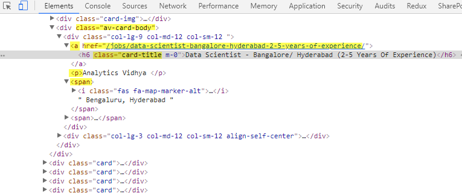

```{r setup, include=FALSE}
knitr::opts_chunk$set(echo = TRUE)
```

### Introduction

The task is to determine "Which are the most valued data science skills". We used web scraping on three different sites, Indeed and DataJobs from the US and AnalyticsVidya from India to come up with the answer. We included India to give us a more global perspective about the skills required to succeed in this role. Keeping time frame in mind, we couldn't include more sites but these sites will give us an idea of the job skills which are required nowadays for data scientists. 

### Approach to the task

We went through the following steps to perform this analysis:

1. We scraped the three mentioned websites for the following fields:

Jobtitle, Company, Location, Linkforthejoblisting, Job description

We needed to perform three different scraping tasks as each of these sites are structured differently.

For indeed.com, we scraped 110 job listings from the first 11 pages. Each page has 10 job listings.There are over 12,000 data scientist jobs listed on indeed and we stuck to a simple size to give similar weight to all three job sites.The indeed page numbers go like 0, 10, 20,...so we formed a loop that goes with a sequence of 10 to scrape the required data.

For datajobs.com, we scraped 240 job listings. The pages follow a sequence of 1, 2, 3... and we scraped the first 20 pages with 12 jobs each page.

For analyticsvidya, we scraped 160 job listings. We focused on the first 20 pages with 8 records per page. The pages follow a sequence of 1,2, 3...

We saved the scraped data in 3 csv files and used the same format for the structure of the files so we could combine them later.

2. Cleaning the data

We combined the three csv files into one so we could have all data in a single file. We then used the tm package to convert all characters to lower, remove numbers and punctuation, and remove the english stopwords. Our wordcloud showed a very high frequency for the words ("will","experience", "work", "andor"), so we removed those too.We then built a term document matrix and sorted the words by the frequency.

3. Analysis

We divided the skills into Technical skills and soft skills. Since there are too many of those cited over the web, we built a dictionary of words to look for when building our frequency plots.For soft skills, we had several different words for the same skills, like communivations, communicate or communicating to represent communication skills. So we used the root word 'communi' to find matches and calculate the frequency. We then plotted appropriate charts to represent the findings.

The process is outlined below:

```{r message=FALSE, out.width='70%', fig.show='hold'}
knitr::include_graphics('process.png')
```

### Communication tools

We used Slack to build a channel for the project and invited the team members in. We installed the app zoom within Slack so we could initiate meetings. We used the share screen functionality to walk each other through our codes. 

We attempted the web scraping part individually as this was new learning for us. We then went through each others codes and the team leader Randy collated the codes for the best one. We used github to request pulls for each of our codes. The rest of the assignment was broken down into individual tasks for each team member depending on the areas where each felt more comfortable. 

We had chats on the main chat window and also windows between members so that whenever we got stuck, we could leave a message.

Due to the time difference between locations, we followed specific dates and tims to meet during the week to discuss next course of action.

```{r message=FALSE, out.width='50%', fig.show='hold'}
knitr::include_graphics('tools.png')
```


### Code to Scrape the pages


First of all, let's load all the required libraries which we used throughout the project. 

```{r message=FALSE}
#Loading the libraries
library(knitr)
library(tm)
library(wordcloud)
library(RColorBrewer)
library(RCurl)
library(XML)
library(stringr)
library(ggplot2)
library(rvest)
library(tidyverse)
library(data.table)
library(DT)
library(tidytext)
library(DBI)
library(RMySQL)
```

#### Scraping data from indeed.com

In the following chunk, we created an empty data frame named "listings" which contain the columns such as jobTitle, company, location, link and jobDescription. We had to make the columns as character to make it workable for stringr and text mining purposes. As discussed above in the introduction, indeed has 10 job postings on each page that's why we had to create sequence from o to 100 with the difference of 10 jobs for each page. Of course, that would be different for each website. To get the data from each page and to get the data for all columns, we created a loop which takes the data from all pages. Inside the loop, all the data for jobtitle, company, location, link and job descriptions were taken in a sequential manner. 


```{r eval=FALSE }
#First we create an empty data frame for our function to fill.
listings <- data.frame(jobTitle=character(),
                       company=character(), 
                       location=character(), 
                       link=character(), 
                       jobDescription = character(),
                       stringsAsFactors=FALSE) 

#indeed goes by 10 in the paging, so we'll iterate the same way.
pages <- seq(from = 0, to = 100, by = 10)  

#This function will loop through each page of listing and scrape out the relevant nodes to fill our data frame. 

for(i in pages) {
  url <- paste0('https://www.indeed.com/jobs?q=data+scientist&l=all&start=',i)
  var <- read_html(url)
  #title
  jobTitle <- var %>% 
    rvest::html_nodes("div") %>%
    rvest::html_nodes(xpath = '//a[@data-tn-element = "jobTitle"]') %>%
    rvest::html_attr("title")%>%
    str_extract("(\\w+.+)+")
  #company
  company <- var %>% 
    rvest::html_nodes("span") %>%
    rvest::html_nodes(xpath = '//*[@class="company"]') %>%
    rvest::html_text()%>%
    str_extract("(\\w+.+)+")
  #location
  location <- var %>%
    rvest::html_nodes("span") %>% 
    rvest::html_nodes(xpath = '//*[@class="location accessible-contrast-color-location"]')%>% 
    rvest::html_text() %>%
    str_extract("(\\w+.)+,.[A-Z]{2}") 
  #link
  link <- var %>%
    rvest::html_nodes("div") %>% 
    rvest::html_nodes(xpath = '//*[@data-tn-element="jobTitle"]')%>% 
    rvest::html_attr('href')
  link <- paste0("https://www.indeed.com",link)
  
  listings <- rbind(listings, as.data.frame(cbind(jobTitle,company,location,link)))
}

#the words will be combined into AllDescriptions
allDescriptions <- ""

#From the listings we've scraped, we will 'click' on each job to see it's description. This function will scrape the descriptions and add it to our data frame.
description <- c()
for (i in (1:length(listings$link))){
    description <- read_html(as.character(listings$link[i])) %>%
    html_nodes(xpath = '//*[@class="jobsearch-jobDescriptionText"]') %>%
    html_text()
    
    
  description <-  gsub(pattern = "\n", replace = "", description)

  listings$jobDescription[i] <- description
  
  #Append description to AllDescription everytime for accumulation
  allDescriptions<- append(allDescriptions, description)
}

# Save to CSV file

#write to a csv file
write.csv(listings, file = "indeed.csv",row.names = FALSE, fileEncoding="UTF-8")

```


As shown in the above chunks, the data was cleaned through stringr's functions to spit the required text of the data. Finally, data was written to csv file.


#### Scraping data from datajobs.com

Now let's start working with the second site for scraping the job skills. An empty data frame was created first in a same way as it was done before with indeed.com. The purpose was obviously to take all the required data from datajobs.com and put them in a dataframe in a sophisticated manner. Here, loop was again created to capture the data from 20 pages with 12 job posting in each page. Furthermore, SelectorGadget was used here to track the nodes and extract job title, company's name, location and link. Furthermore, tm package was used to clean the data in order to extract the job skills to make them understandable. All the data were binded together in a dataframe which shows all the job skills and related information/.

```{r eval=FALSE}
listingsdata <- data.frame(jobTitle=character(),
                       company=character(), 
                       location=character(), 
                       link=character(), 
                       jobDescription = character(),
                       stringsAsFactors=FALSE) 
BaseURL <- "https://datajobs.com/"
jURL <- "https://datajobs.com/Data-Science-Jobs~"
numPages <- 20  #(20pages x 12records-per-page = 240records)
for(page in 1:numPages) {
  url <- paste0(jURL, page)
  var <- read_html(url)
  jobTitle <- var %>% 
      html_nodes("div.stealth-header a strong") %>% 
      html_text()
  company <- var %>%
      html_nodes("div.stealth-header a span") %>%
      html_text()
  location <- var %>%
     rvest::html_nodes("div.stealth-header em span") %>%  
     html_text()
  link <- var %>%
    html_nodes("div.stealth-header a") %>%
    html_attr('href')
  link <- paste0(BaseURL,link)
  
  listingsdata <- rbind(listingsdata, as.data.frame(cbind(jobTitle,company,location,link)))
}

#our corpus
allDescriptions <- ""
description <- c()
for (i in (1:length(listingsdata$link))){
   description <- read_html(as.character(listingsdata$link[i])) %>%
      html_nodes(".jobpost-table-cell-2.stealth-header p") %>%
      html_text()
   description <-  gsub(pattern = "\n", replace = "", description)
  # Encoding(description) <- 'UTF-8'
   listingsdata$jobDescription[i] <- description
  #Append description to AllDescription everytime for accumulation
   allDescriptions<- append(allDescriptions, description)
}

## Save to CSV file
#write to a csv file
write.csv(listingsdata, file ="datajobs.csv", row.names = FALSE, fileEncoding="UTF-8")

```


#### Scraping data from analyticsvidya.com

Now let's scrap the third website so find out the most significant data science skills from analyticsvidya.com. For that purpose, we scraped 20 pages with each page containing 8 job postings. Again, we created an empty data fram with the same column names because eventually all the data science skills from 3 websites would be merged together in a single dataframe which would be eventually used for data analysis. Loop was created to capture the data from all 20 pages with relevant information in a tidy way. 


Here is the page source of analyticsvidhya.com which is in css. This is just to show our working on nodes and how we extracted the data. 


```{r message=FALSE, out.width='50%', fig.show='hold'}

```

```{r eval=FALSE}
listingsdata1 <- data.frame(jobTitle=character(),
                       company=character(), 
                       location=character(), 
                       link=character(), 
                       jobDescription = character(),
                       stringsAsFactors=FALSE) 
BaseURL <- "https://jobsnew.analyticsvidhya.com"
jURL <- "https://jobsnew.analyticsvidhya.com/jobs/all?title=data+scientist&page="
numPages <- 20  #(20pages x 8records-per-page = 160records)

for(page in 1:numPages) {
  #construct the URL
  url <- paste0(jURL, page)
  var <- read_html(url)
  
  jobTitle <- var %>% 
      html_nodes(".av-card-body .card-title") %>%
      html_text()
  
  company <- var %>%
      rvest::html_nodes(".av-card-body p") %>%
      html_text()
  
  location <- var %>%
     rvest::html_nodes(".av-card-body span") %>%   #i.fas.fa-map-marker-alt  span:first-child  :nth-child(1)
     html_text()
  location <- location[c(TRUE, FALSE)]
  
  link <- var %>%
    html_nodes(".av-card-body .col-lg-9.col-md-12.col-sm-12 a") %>%
    html_attr('href') 
    link <- paste0(BaseURL,link)
  
  listingsdata1 <- rbind(listingsdata1, as.data.frame(cbind(jobTitle,company,location,link)))
} 

## Get JobDescription From Links and gather our corpus of words
#our corpus

allDescriptions <- "" 
description <- c()
for (i in (1:length(listingsdata1$link))){
   vdescription <- read_html(as.character(listingsdata1$link[i]))
   description <- vdescription %>%
      html_nodes(".card-body p:last-child") %>%
      html_text()
   
   
  description <-  gsub(pattern = "\\[\\]", replace = "", description)
  # Encoding(description) <- 'UTF-8'
  listingsdata1$jobDescription[i] <- description
  
  #Append description to AllDescription everytime for accumulation
 allDescriptions<- append(allDescriptions, description)
 
}


## Save to CSV file
#write to a csv file
write.csv(listingsdata1, file ="vidhya.csv", row.names = FALSE, fileEncoding="UTF-8")

```

Now moving forward while all the sites are already scraped, let's just save all files in github

The three csv files have been uploaded to github at:

https://github.com/abhajjam/Data607_Project3

### Importing the csv into MySQL and reading back to R

As per the requirements of Project, all the fies were supposed to be pushed in MySQL in the database but before doing that, let's just merge all the files together and make a single dataframe for further analysis. Before going to MySQL, let's just bind all three files using rbind function. New schema was created and the new file was then pushed in MySQL in the database. 

```{r eval=FALSE}
#Putting all data in a single dataframe
indeed<-read.csv("indeed.csv")
vidhya<-read.csv("vidhya.csv")
datajobs<-read.csv("datajobs.csv")
listings1<-rbind(indeed,vidhya,datajobs)


#Connecting to MySQL
drv<-dbDriver("MySQL")
conn <- dbConnect(drv, user="root", password="password", host="127.0.0.1", port=3306, dbname="data")
dbListTables(conn)
#Writing the table to MySQL for storage
dbWriteTable(conn, "final", listings1, overwrite = TRUE, row.names = FALSE)
dbDisconnect(conn)
```

A connection was created with the local database in MySQL and the file was then moved there. Furthermore, to avoid overwriting we had to set eval = FALSE to avoid any further hussle in database. Due to security concerns, MySQL does not let importing the data from external sources for which we had to grant permission to the user. 


Now let's get the job description back into the R using MySQL's query. Also, the database is needed to be disconnected once the data is extracted from MySQL.


```{r}
#Reading only the job description back into R
drv<-dbDriver("MySQL")
conn <- dbConnect(drv, user="root", password="password", host="127.0.0.1", port=3306, dbname="data")
mysql <- " 
    SELECT jobDescription, location
    FROM final
"
final <- dbGetQuery(conn, mysql)
dbDisconnect(conn)
```

### Cleaning the text using tm

While going through the reading materials and references, we came across the tm package which seemed quite interesting and easy to clean the data. Since all the job descriptions were not in a way where we could use frequencies to find out the most demanding data science skills, we had to use text mining related package. Using the package, we removed all the numbers, punctions, some of the frequently used English words such as experience, will, work, etc to get into the specific list of skills. 

```{r warning=FALSE}
# putting the words in vector
words <- Corpus(VectorSource(final$jobDescription))
#using tm to remove numbers, punctuation and convert to lowercase. Some high frequency words we do not want are removed.
words <- tm_map(words, tolower)
words <- tm_map(words, removeNumbers)
words <- tm_map(words, removePunctuation)
words <- tm_map(words, removeWords, stopwords("english"))
words <- tm_map(words, removeWords, c("will","experience", "work", "andor"))

#Build a term-document matrix and dataframe d to show frequency of words
tdm <- TermDocumentMatrix(words)
m <- as.matrix(tdm)
v <- sort(rowSums(m), decreasing=TRUE)
d <- data.frame(word = names(v), freq=v)
head(d, 10)

```
Furthermore, with the help of tm package, we ended up getting the list of data science skills which were then saved in a matrix to use for data visualization and analysis. 


### More data cleaning and Visualization

After completion of web scraping and saving the file into database and getting back the relevant information, let's do some visualization to see the most frequent words from the data. Let's see the most frequest data skills in world cloud which is also known as text cloud. It gives pretty good information of the text and the frequency. After plotting the horizontal barchart on the data, it seems that data is the most frequent word used in the job descriptions which make sense obviously. If we take a look at the plot, it seems that learning, business, team, science, machine, analytics are the most frequently used words in the job description. 


``` {r}
#Generate the Word cloud
set.seed(1234)
wordcloud(words = d$word, freq = d$freq, min.freq = 20,
          max.words=50, random.order=FALSE, rot.per=0.35, 
          colors=brewer.pal(8, "Dark2"))

```

Frequency Plot for the top 25 words frequencies

```{r}
ggplot(head(d, 25), aes(reorder(word, freq),freq)) +
  geom_bar(stat = "identity", fill = "#03DAC5") +  #03DAC6   #6200EE
  labs(title = "Data Science Job wording frequency",
       x = "Words", y = "Frequency") +
  geom_text(aes(label=freq), vjust=0.4, hjust= 1.2, size=3, color="white")+
  coord_flip()
```


The above visualization clearly shows that the data is not yet clean as there are a lot of non-relevant words are still there in the data such as learning, team, data, product, etc. Some of them are non-technical skills and some of them are actually non-relevant. To make some sense out of data, we have to clean up the data to see a better picture of technical and soft skills that are needed for data scientists. 


### Summing up the data / Data Summary

As we discussed above that the data is not yet clean that's why we have to summarize the data and remove the irrelevant stuff. We are only going to add the technical skills that are most frequently used in the data through using mutation and conditional function as shown in the below chunk of codes. 

```{r}

final <-  final %>%
    #mutate(R = ifelse(grepl("\\bR\\b,", jobDescription, ignore.case = TRUE ),1,0)) #%>%   #### Technical skills
    mutate(python = ifelse(grepl("python", jobDescription, ignore.case = TRUE),1,0)) %>%
    mutate(SQL = ifelse(grepl("SQL", jobDescription, ignore.case = TRUE),1,0)) %>%
    mutate(hadoop = ifelse(grepl("hadoop", jobDescription, ignore.case = TRUE),1,0)) %>%
    mutate(perl = ifelse(grepl("perl", jobDescription, ignore.case = TRUE),1,0)) %>%
    mutate(C = ifelse(grepl("\\bC\\b", jobDescription, ignore.case = TRUE),1,0)) %>%
    mutate(aws = ifelse(grepl("aws", jobDescription, ignore.case = TRUE),1,0)) %>%
    mutate(excel = ifelse(grepl("excel", jobDescription, ignore.case = TRUE),1,0)) %>%
    mutate(nosql = ifelse(grepl("nosql", jobDescription, ignore.case = TRUE),1,0)) %>%
    mutate(linux = ifelse(grepl("linux", jobDescription, ignore.case = TRUE),1,0)) %>%
    mutate(azure = ifelse(grepl("Azure", jobDescription, ignore.case = TRUE),1,0)) %>%
    mutate(sas = ifelse(grepl("\\bsas\\b", jobDescription, ignore.case = TRUE),1,0)) %>%
    mutate(Cplusplus = ifelse(grepl("C\\+\\+", jobDescription, ignore.case = TRUE),1,0)) %>%
    mutate(VB = ifelse(grepl("VB", jobDescription, ignore.case = TRUE),1,0)) %>%
    mutate(java = ifelse(grepl("java\\b", jobDescription, ignore.case = TRUE),1,0)) %>%
    mutate(csharp = ifelse(grepl("(\\bc#\\b)", jobDescription, ignore.case = TRUE),1,0))%>%
    mutate(scala = ifelse(grepl("scala", jobDescription, ignore.case = TRUE),1,0)) %>%
    mutate(tensorflow = ifelse(grepl("tensorflow|\\btf\\b", jobDescription, ignore.case = TRUE),1,0)) %>%
    mutate(javascript = ifelse(grepl("javascript", jobDescription, ignore.case = TRUE),1,0)) %>%
    mutate(spark = ifelse(grepl("spark", jobDescription, ignore.case = TRUE),1,0))%>%
    mutate(bi = ifelse(grepl("(\\bbi\\b|business intelligence)", jobDescription, ignore.case = TRUE),1,0))%>%
    mutate(ml = ifelse(grepl("(\\bml\\b|machine learning)", jobDescription, ignore.case = TRUE),1,0))%>%  ### general skills
    mutate(stat = ifelse(grepl("statis", jobDescription, ignore.case = TRUE),1,0))%>%
    mutate(visual = ifelse(grepl("visual", jobDescription, ignore.case = TRUE),1,0))%>%
    mutate(deep_learn = ifelse(grepl("(deep learning|neural net)", jobDescription, ignore.case = TRUE),1,0))%>%
    mutate(nlp = ifelse(grepl("(nlp|nature language )", jobDescription, ignore.case = TRUE),1,0))%>%
    mutate(math = ifelse(grepl("(mathematics)", jobDescription, ignore.case = TRUE),1,0))%>%
    mutate(AI = ifelse(grepl("(artificial intelligence|\\bai\\b)", jobDescription, ignore.case = TRUE),1,0))%>%
    mutate(software_dev = ifelse(grepl("software development|software engineer", jobDescription, ignore.case = TRUE),1,0))%>%
    mutate(analysis = ifelse(grepl("(analysis)", jobDescription, ignore.case = TRUE),1,0))%>%
    mutate(project_management = ifelse(grepl("project management", jobDescription, ignore.case = TRUE),1,0))%>%
    mutate(data_engineer = ifelse(grepl("data engineering", jobDescription, ignore.case = TRUE),1,0))

#Soft skills
#Now lets plot the frequency of each category of soft skills. 
# Top 10 Soft Skills Employer Love https://resumegenius.com/blog/resume-help/soft-skills
final <-  final %>%
   mutate(communication = ifelse(grepl("communi", jobDescription, ignore.case = TRUE),1,0)) %>%
   mutate(teamwork = ifelse(grepl("teamwork|collaboration", jobDescription, ignore.case = TRUE),1,0)) %>%
   mutate(adaptability = ifelse(grepl("adaptability|flexibility", jobDescription, ignore.case = TRUE),1,0)) %>%
   mutate(problem_solving = ifelse(grepl("problem-solving|solv", jobDescription, ignore.case = TRUE),1,0)) %>%
   mutate(creativity = ifelse(grepl("creativ|inspiration", jobDescription, ignore.case = TRUE),1,0)) %>%
   mutate(work_ethic = ifelse(grepl("ethic|integrity|professionalism", jobDescription, ignore.case = TRUE),1,0)) %>%
   mutate(leadership = ifelse(grepl("leader|management", jobDescription, ignore.case = TRUE),1,0)) %>%
   mutate(interpersonal_skills = ifelse(grepl("interpersonal|public speaking|mentoring", jobDescription, ignore.case = TRUE),1,0)) %>%
   mutate(time_management = ifelse(grepl("time_management|prioritizing|organization", jobDescription, ignore.case = TRUE),1,0))

```

Now let's transform all the technical skills into a table to see which of them are mostly in demand. Dplyr is particularly used to do data wrangling to see frequencies of those skills as shown below. We will do same thing with non-technical skills as well to see how important are those for data scientists. We will discuss all those skills in conclusion. 

```{r}

#Transform the table for tech skills

listings_ts <- final %>%
      gather("skills","frequency", 3:33) %>%
      group_by(skills) %>%
      summarise(frequency=sum(frequency))%>%
      arrange(desc(frequency))

listings_ts
```


```{r}
tech_chart <- ggplot(listings_ts, aes(x = reorder(skills, frequency), y= frequency))+
              geom_bar(stat = "identity", fill="steelblue")+
              labs(title = "Data Science required tech skills frequency", x = "Tech skills", y = "Frequency")+
              geom_text(aes(label=frequency), vjust=0.4, hjust= 1.2, size=2.5, color="white")+
              coord_flip()
tech_chart
```

```{r}
#Transform the table for soft skills
listings_ss <- final %>%
      gather("skills","frequency", 34:42) %>%
      group_by(skills) %>%
      summarise(frequency=sum(frequency))%>%
      arrange(desc(frequency))

listings_ss
```


```{r}
soft_chart <- ggplot(listings_ss, aes(x = reorder(skills, -frequency), y= frequency))+
              geom_bar(stat = "identity", fill="steelblue")+
              labs(title = "Data Science required soft skills frequency", x = "Soft skills", y = "Frequency")+
              theme(axis.text.x = element_text(angle = 45, , hjust = 1))+
              geom_text(aes(label=frequency), vjust=-0.4, hjust= 0.5, size=4)
soft_chart
```

### Summary of Data analysis

The above barplots show that Python, Machine Learning, Stats, SQL and Hadoop are the top most tech skills that are essential for the data scientists while on soft skills side; leadership, communication skills and problem-solving skills are the most important skills to become a successful data scientist. 


### Conclusion and learning

Finally, going forward to wind up the project, we started the web scraping from three different websites i.e. indeed, datajobs and analyticsvidhya to extract the most demanding data science skills. For that purpose, we did not only see those in United States but we also get the data from Indian market to see the global aspect. We generated loops to gather the data from all those 3 websites and then created an empty dataframe for each of them in order to store those data there. All the data were merged into a single dataframe to make the further process easier and then the data was pushed to the database. The permissions had to be granted to all users to make it accessible. Different packages were used to do data analysis and cleaning. Tm package was found quite helpful as it cleaned the data very efficiently. Job descriptions were taken out of the database and it was cleaned to do some data analysis. As per the initial data visualization, data seemed dirty and a lot of non-relevant words were showing as most frequently used words. They were cleaned through using tm package and then the final data analysis was conducted. On technical skills side, Python, SQL, machine learning, Stats and Hadoop were the most demanding skills while on non-technical skills side, communication, leadership and problem-solving skills were found as essential soft skills. 
